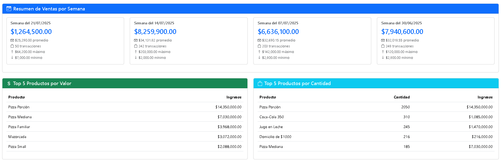
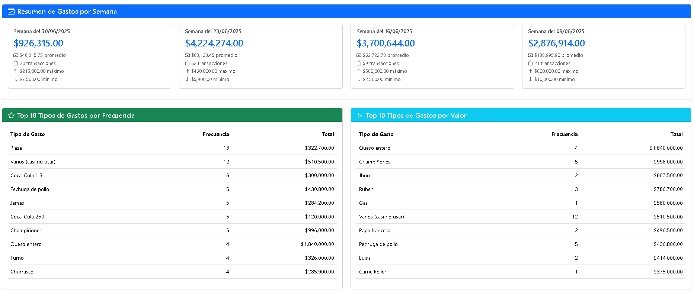
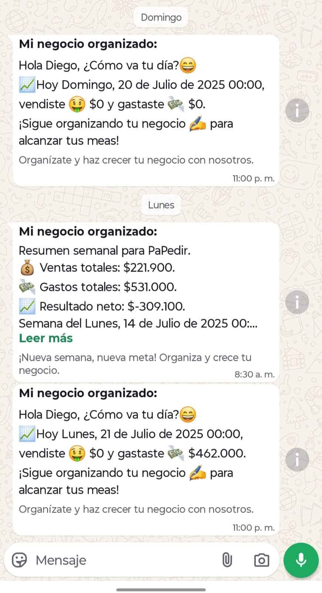

# Mi Negocio Organizado

---

### 🔒 Aviso sobre el código fuente

> Este repositorio **no contiene el código fuente** del proyecto.  
> Su propósito es únicamente **presentar las funcionalidades y objetivos** de la plataforma.  
> Si estás interesado en colaborar o conocer más, no dudes en escribirme. ¡Estoy buscando aliados para construir juntos!

---

**Mi Negocio Organizado** es una plataforma **POS y ERP en la nube**, diseñada para **pequeñas empresas**.  
Permite gestionar **ventas, gastos, inventarios, reportes y automatización** con una interfaz sencilla y moderna.

[🌐 Visitar sitio web](https://minegocioorganizado.com)

---

## ✨ Funcionalidades principales
- **POS (Punto de Venta):** Gestión de ventas en tiempo real con múltiples métodos de pago.  
- **Automatización:** Notificaciones y resúmenes automáticos vía **WhatsApp Business API**.  
- **Reportes y análisis:** Panel con métricas diarias, semanales y mensuales.  
- **Gestión de gastos e inventarios:** Control detallado con categorías y tipos de gasto.  
- **Multi-tenant:** Soporta múltiples organizaciones con datos aislados.
- **Análisis IA:** Reportes de analisis gestionados por inteliencia artificial. 

---

## 🛠 Tecnologías
- **Backend:** Ruby on Rails 7.1.3 (Ruby 3.3.1)  
- **Base de datos:** PostgreSQL  
- **Frontend:** Bootstrap 5, Turbo Rails, Stimulus  
- **Background Jobs:** Sidekiq + Redis  
- **Integraciones:** OpenAI API, WhatsApp Business API  
- **Infraestructura:** Hetzner-cloud

---

## 📷 Capturas de pantalla

